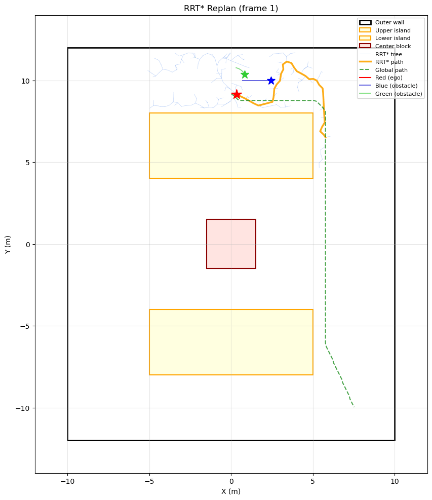

# EE/CS 265A - Final Project

**Hierarchical Global-Local Motion Planning for Dynamic Obstacle Avoidance**


## Packages

| Package | Description |
|---------|-------------|
| `f1tenth_gazebo` | Gazebo simulation with 3 colored race cars (Red, Blue, Green) and a race track |
| `ee_cs_265a` | Motion planning algorithms: global planner, local planner, pure pursuit, dynamic agents |

## Prerequisites

| Requirement | Version |
|-------------|---------|
| Ubuntu | 22.04 (Jammy) |
| ROS 2 | Humble |
| Gazebo | Ignition Fortress (6.x) |

## Installation

```bash
# Install dependencies
sudo apt install -y \
    ros-humble-ros-gz \
    ros-humble-ros-gz-sim \
    ros-humble-ros-gz-bridge \
    ros-humble-ros-gz-interfaces \
    ros-humble-robot-state-publisher \
    ros-humble-xacro \
    ros-humble-joint-state-publisher \
    ros-humble-teleop-twist-keyboard \
    ros-humble-nav2-map-server \
    ros-humble-nav2-amcl \
    ros-humble-nav2-lifecycle-manager \
    ros-humble-tf2-geometry-msgs

# Python dependencies
pip install numpy scipy pillow matplotlib

# Build workspace
cd ~/ee_cs_265A_ws
colcon build
source install/setup.bash
```

## Usage

### Running the Full System

Open **two terminals**:

**Terminal 1 — Simulation (Gazebo + bridges + TF)**
```bash
source ~/ee_cs_265A_ws/install/setup.bash
ros2 launch f1tenth_gazebo f1tenth_ign.launch.py
```

**Terminal 2 — Planning stack (planner + agents + localization)**
```bash
source ~/ee_cs_265A_ws/install/setup.bash
ros2 launch ee_cs_265a planning.launch.py
```

This launches:
- **Global Planner** — A* path from start (0, 9.2) to goal (7.5, -10) on the inflated map
- **Local Planner** — RRT-based reactive planner that detects dynamic obstacles via lidar and plans detours
- **Pure Pursuit** — Geometric path tracker following the local planner's output
- **AMCL** — Adaptive Monte Carlo Localization for the red car (map→odom correction)
- **Blue Agent** — Scripted obstacle car driving clockwise around the outer loop at 0.6 m/s
- **Green Agent** — Scripted obstacle car driving counter-clockwise around the outer loop at 0.5 m/s
- **Trajectory Plotter** — Records all three car trajectories, saves plot to `src/ee_cs_265a/trajectory_plot.png` every 1s

### Visualize in RViz

```bash
source ~/ee_cs_265A_ws/install/setup.bash
rviz2 -d ~/ee_cs_265A_ws/src/ee_cs_265a/config/planning.rviz
```

Useful topics to add manually:
- `/inflated_map` (OccupancyGrid) — inflated obstacle map
- `/global_path` (Path) — A* planned path
- `/local_path` (Path) — local planner output (detours around dynamic obstacles)
- `/red/scan` (LaserScan) — lidar

### Drive Cars Manually (optional)

```bash
# Teleop RED car
ros2 run teleop_twist_keyboard teleop_twist_keyboard --ros-args -r cmd_vel:=/red/cmd_vel

# Or publish directly
ros2 topic pub /red/cmd_vel geometry_msgs/msg/Twist "{linear: {x: 1.0}, angular: {z: 0.0}}" -r 10
```

## Results

### RRT* Dynamic Replanning



The animated GIF shows real-time RRT\* replanning as the red ego vehicle navigates around the blue obstacle car in the right corridor. Each frame captures the tree exploration (light blue), the chosen detour path (orange), and the evolving trajectories of all three cars.

## Architecture

```
Global Planner ──► /global_path ──► Local Planner ──► /local_path ──► Pure Pursuit ──► /red/cmd_vel
                                         ▲
                                /red/scan + /inflated_map
                                (dynamic obstacle detection)

Blue Agent ──► /blue/cmd_vel    (scripted clockwise loop)
Green Agent ──► /green/cmd_vel  (scripted counter-clockwise loop)
```

### Node Details

| Node | Description |
|------|-------------|
| `global_planner` | A* on inflated occupancy grid with proximity cost for corridor centering |
| `local_planner` | RRT-based replanner — passes global path when clear, plans detour when blocked by dynamic obstacles |
| `pure_pursuit` | Geometric path tracker with adaptive lookahead and speed-curvature coupling |
| `dynamic_agent` | Proportional-steering waypoint follower for blue/green obstacle cars |
| `trajectory_plotter` | Records and plots all car trajectories to PNG |

## ROS 2 Topics

### Velocity Commands (geometry_msgs/msg/Twist)

| Car | Topic |
|-----|-------|
| Red | `/red/cmd_vel` |
| Blue | `/blue/cmd_vel` |
| Green | `/green/cmd_vel` |

### Odometry (nav_msgs/msg/Odometry)

| Car | Topic |
|-----|-------|
| Red | `/red/odometry` |
| Blue | `/blue/odometry` |
| Green | `/green/odometry` |

### Planning

| Topic | Type | Description |
|-------|------|-------------|
| `/global_path` | Path | A* planned path (start to goal) |
| `/local_path` | Path | Local planner output (with RRT detours) |
| `/inflated_map` | OccupancyGrid | Inflated obstacle map |
| `/red/scan` | LaserScan | Red car's lidar |

## Track Layout

```
         ┌──────────────────────────────────┐  y=12
         │          OUTER WALL              │
         │   ┌────────────────────┐         │  y=8
         │   │   UPPER ISLAND    │         │
         │   └────────────────────┘         │  y=4
         │          ┌──────┐                │  y=1.5
         │          │CENTER│                │
         │          └──────┘                │  y=-1.5
         │   ┌────────────────────┐         │  y=-4
         │   │   LOWER ISLAND    │         │
         │   └────────────────────┘         │  y=-8
         │     [obs]        [obs]           │  y=-10
         └──────────────────────────────────┘  y=-12
       x=-10                              x=10
```

| Property | Value |
|----------|-------|
| Outer Walls | x ∈ [-10, 10], y ∈ [-12, 12] |
| Upper Island | x ∈ [-5, 5], y ∈ [4, 8] |
| Lower Island | x ∈ [-5, 5], y ∈ [-8, -4] |
| Center Block | x ∈ [-1.5, 1.5], y ∈ [-1.5, 1.5] |
| Corridor Width | ~4m outer, ~3.3m middle |
| Static Obstacles | 2 boxes at (±3, -10), 2 cylinders at (±7.5, ±6) |

## References

- [F1Tenth](https://f1tenth.org/)
- [ROS 2 Humble](https://docs.ros.org/en/humble/)
- [Ignition Gazebo](https://gazebosim.org/)
